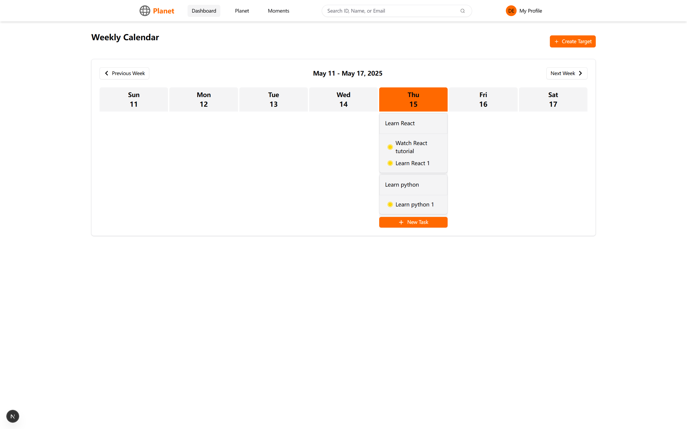
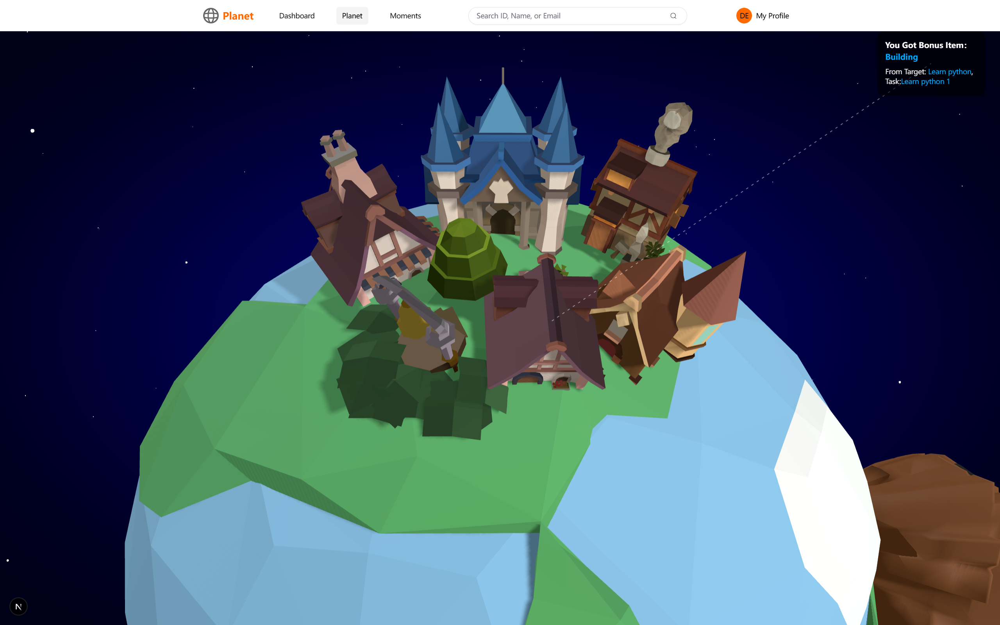
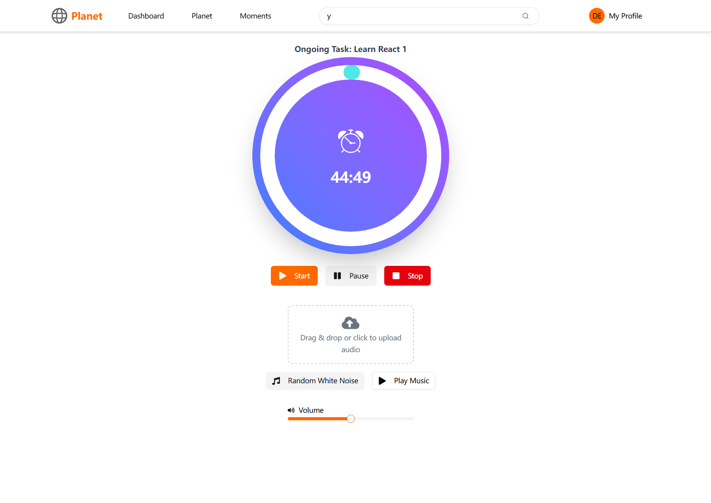
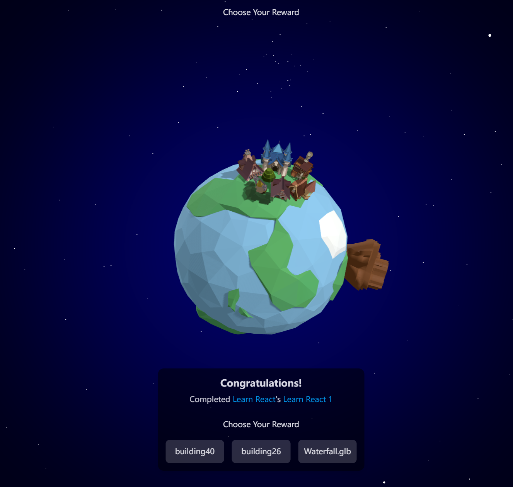
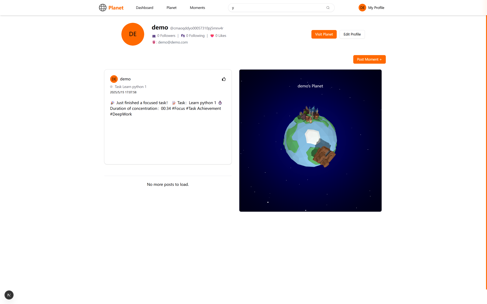

# Focus Planet 🌏 | 3D Gamified Productivity Platform

> **Transforming daily tasks into an immersive planetary universe.**

[](https://group-project-virtualdominated.vercel.app)
[](LICENSE)


---

## 👨‍💻 My Key Contributions (Kate Yi)

In this collaborative project, I took **End-to-End Ownership** of the core productivity engine and bridged the gap between functional logic and the 3D gamification system.

### 1. Focus Timer System (Full Stack Implementation)

I designed and built the **Pomodoro-style Focus Timer** from scratch, which is the central driver of user engagement.

- **Frontend Architecture:** Designed the UI/UX for the timer interface, implementing complex state management to handle countdowns, pause/resume logic, and session interruptions seamlessly.
- **Backend Integration:** Developed robust API endpoints to synchronize user focus data in real-time. ensured that session data is accurately persisted to MongoDB even if the browser is closed unexpectedly.
- **Responsive Design:** Optimized the timer layout to ensure a native-app-like experience on both desktop and mobile devices.

### 2. Gamification & 3D Integration

I played a key role in connecting the productivity tools with the 3D visual environment.

- **Logic-to-Visual Bridge:** I implemented the logic that translates "Time Focused" into "Visual Rewards." When a user completes a timer session, my code triggers the event system that updates the 3D planet's inventory.
- **Immersive Feedback Loop:** Collaborated on the Three.js integration to ensure users receive immediate, satisfying visual feedback upon task completion, reinforcing the habit-building loop.

---

## 📸 Visual Journey & Features

**Focus Planet** combines utility with gaming. Here is a tour of the application:

### Core Productivity & 3D Interaction

|        **Home Page (Target Management)**        |             **Personal 3D Planet**             |
| :---------------------------------------------: | :--------------------------------------------: |
|                       |               |
| _Manage long-term targets and breakdown tasks._ | _Your unique 3D world that grows as you work._ |

### The Focus Engine (My Main Contribution)

|             **Focus Timer Interface**             |            **Reward Collection**             |
| :-----------------------------------------------: | :------------------------------------------: |
|                       |            |
| _Distraction-free timer with real-time tracking._ | _Unlocking decorative assets after success._ |

### Social & User Profile

|    **Profile & Achievements**     |     |
| :-------------------------------: | :-: |
|      |
|  |

---

## 📖 Project Overview

**Focus Planet** is a Progressive Web Application (PWA) that addresses the lack of motivation in traditional to-do lists. By leveraging **Three.js** and **Next.js**, it introduces a unique concept: **"Productivity creates Worlds."**

Users set long-term targets, break them down into tasks, and use the **Focus Timer** to complete them. Every minute of focus translates into resources, allowing users to build and decorate their own 3D planet in a shared universe.

### 🛠️ Technical Stack

- **Frontend:** React 18, Three.js (React Three Fiber), Tailwind CSS, Shadcn UI
- **Backend:** Next.js API Routes (Serverless)
- **Database:** MongoDB Atlas, Prisma ORM
- **Testing:** Playwright (E2E)
- **DevOps:** Docker, Vercel CI/CD

---

## 🚀 Getting Started

Follow these steps to run the project locally.

### Prerequisites

- Node.js v22.14.0 (managed via `.nvmrc`)
- MongoDB Instance

### Installation

1.  **Clone the repository**

    ```bash
    git clone git@github.com:your-username/focus-planet.git
    cd focus-planet
    ```

2.  **Setup Environment**
    Create a `.env` file in the root directory:

    ```env
    DATABASE_URL="mongodb+srv://..."
    BACKEND_URL="http://localhost:3000"
    ```

3.  **Install Dependencies**

    ```bash
    nvm use
    npm install
    ```

4.  **Initialize Database**

    ```bash
    npm run prisma:generate
    ```

5.  **Run Development Server**
    ```bash
    npm run dev
    ```
    Open [http://localhost:3000](http://localhost:3000) to view the app.

---

## 🐳 Deployment (Docker)

The application is containerized for consistent deployment.

```bash
# Build the image
docker build -t focus-planet .

# Run container
docker run -p 3000:3000 -e DATABASE_URL="..." focus-planet
```
